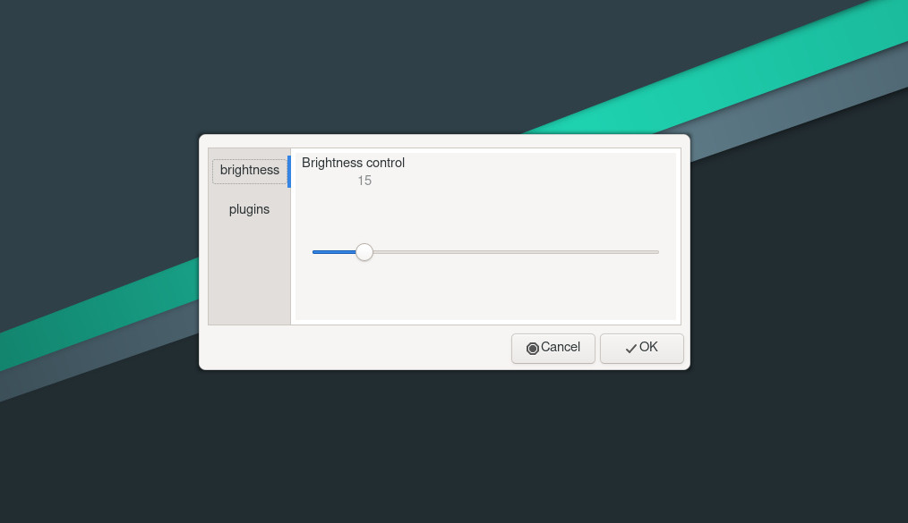

# Dama

## Desktop Agnostic Menu Aggregate

This program aims to be a hackable, easy to use menu that can be paired to 
lightweight window managers in order to change settings on the fly.

The program itself is a very thin wrapper around `YAD`, and does nothing but provide
a way to launch some dialogs tied together in a tabbed window.

The individual dialogs are not necessarily a part of `DAMA`, although a few ship with it.

## Dependencies

only `yad` is needed, but the example provided uses `xbacklight` as a backend.

if you are on an Arch-based distribuition:

~~~
sudo pacman -S yad
~~~

if you are on a Debian-based distribution:

~~~
sudo apt install yad
~~~

## Installation

To install `DAMA`, simply run in a terminal:

~~~
$ ./setup.sh
$ sudo make install
~~~

The first command will copy the default menu items to your `dama` folder, 
which will be `$XDG_CONFIG_HOME/dama` if that environment variable is set,
or simply `$HOME/.config/dama` if it is not.

You can skip this part if you do not want to use the default menus and want to provide your own.

The second command will install the script as an executable and provide a desktop entry.

## Looks

The appearance of the program is determined by the theme and how `yad` handles it, here's how it looks
with the adwaita theme.

## writing your own pages

Any executable file in the root of your `dama` folder will be interpreted as a page to 
be added to the menu. Such an executable must pass over the first argument it takes to the
`--plug` argument of the yad instance it spawns, and the second to the `--tabnum` argument.
The name of the corresponding tab will be equal to the executable's name, minus the extension
(for example `$DAMA_CONFIG_DIR/brightness.sh` results in a tabname of `brightness`).
Your script may call other executables in the `dama` directory, but these cannot be in the top 
level to avoid being called by the main executable.

## Future plans / Unexpected findings

Unfortunately, I have discovered a few limitations that will not allow the project to reach the target
I had set for it, and they mostly have to do with how yad handles the notebook dialogs.

As it stands, YAD relies on the xembed protocol to achieve multiple dialogs in a single window, meaning
that good wayland support is not to be taken for granted. Since one of the main aims of this project is
to be as independent of the desktop as possible, yad is definitely not the best foundation to build it on.

Additionally, I have noticed that nesting panes and tabs also creates segfaults; I have opened an issue to 
check that this is not a problem on my end, but at this point I am pretty sure I will need to think of a
different approach. This means that I will probably build the whole thing in either python, C or Rust.
